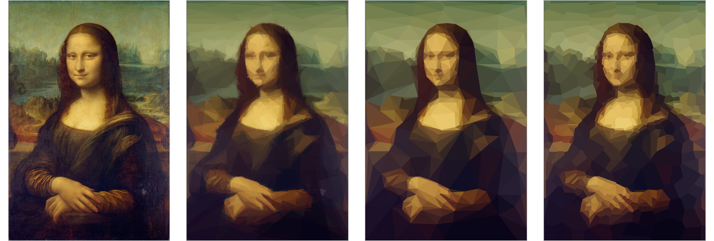

# Geometric Art

Rebuilds a photo as overlapping translucent shapes, or as a gap-free mesh of
flat-coloured triangles or polygons, entirely in your browser. Drop in a
photo or pick one of the built-in samples; the picture never leaves your
machine — there is no server, no upload, nothing sent anywhere.

Live site: [ryanmye.github.io/geometric-art](https://ryanmye.github.io/geometric-art/)



The same photo recreated in all three styles (overlapping shapes, triangle mesh, polygon mosaic), next to the original. Sample: Mona Lisa, Leonardo da Vinci, c. 1503-1519, public domain ([source](https://commons.wikimedia.org/wiki/File:Mona_Lisa,_by_Leonardo_da_Vinci,_from_C2RMF_retouched.jpg)).

## Try it locally

```
npm install
npm run dev
```

Opens a local dev server. Drop a photo onto the page, paste one, or pick one
of the built-in samples, then press Start.

Run the tests:

```
npm test
```

Build the static site (type-checks with `tsc --noEmit`, then bundles with Vite):

```
npm run build
```

The output goes to `dist/`, built with relative asset paths so it works when
served from a subpath (such as `https://<user>.github.io/<repo>/`).

### Command-line scripts

The engines also run standalone in Node, outside the browser UI, useful for
batch runs or benchmarking.

Overlapping shapes:

```
npx tsx scripts/run.ts <in.png> <out.png> [--shapes N] [--seed S] \
    [--types triangle,ellipse] [--quality draft|standard|fine] [--alpha A] \
    [--importance 0..1] [--json out.json]
```

Triangle mesh or polygon mosaic:

```
npx tsx scripts/mesh.ts <in.png> <out.png> [--points N] [--seed S] \
    [--quality draft|standard|fine] [--generations G] [--cells triangles|polygons] \
    [--svg out.svg] [--json out.json] [--scale K] [--importance 0..1] \
    [--frames N --variation 0..1 [--fps F]]
```

With `--frames`, `mesh.ts` makes a seed animation instead of a single mesh:
frames are written as `out-00.png`, `out-01.png`, ...; `--svg` writes the
looping animated SVG and `--json` the animation JSON. `--cells polygons`
draws Voronoi cells instead of triangles (see "Polygon mosaic" below) and
defaults to 600 points instead of 300.

Both scripts use the input PNG at its own resolution (resize it yourself
first; the page works at 256 px by default). `--importance` weights each
pixel's error by edge strength, exactly as the page's "Detail focus" slider
does; without it, both scripts use the same default strength as an
untouched page (0.75), and `--importance 0` turns weighting off entirely.
`scripts/run.ts`'s `--types` takes a comma-separated list from `triangle`,
`rectangle`, `rotatedRectangle`, `ellipse`, `rotatedEllipse`. Both print the
final error score, the strength used, and the time taken. For example:

```
npx tsx scripts/run.ts tests/fixtures/mona-lisa-256.png out/mona.png --shapes 10 --quality draft
npx tsx scripts/mesh.ts tests/fixtures/mona-lisa-256.png out/mona-mesh.png --points 40 --quality draft
```

Two smaller scripts help look at the pieces on their own:

```
npx tsx scripts/importance.ts <in.png> <out.png> [--strength 1] [--blur 0.03]
npx tsx scripts/gif.ts <out.gif> <frame1.png> <frame2.png> ... [--delay 125] [--dither] [--loop 0] [--colors 256] [--local]
```

`importance.ts` writes the importance map itself (see "Detail focus" below)
as a greyscale picture, to look at. `gif.ts` builds an animated GIF from a
list of same-size PNG frames — pair it with `run.ts` or `mesh.ts` run
several times with different `--seed` values to make the frames.

## How it works

There are two independent engines behind the three styles: the shapes
engine, and the mesh engine, which also drives the polygon mosaic style.

### Overlapping shapes

The picture is built one shape at a time. For each new shape:

1. A number of random candidate shapes are tried, and the best of them is
   kept.
2. That shape is then improved by hill climbing: small random changes
   (nudging a point, a radius, an angle) are tried one at a time and kept
   only when they reduce the error, until a run of changes in a row fails to
   improve it.
3. The shape's colour is never searched for — it is computed directly as the
   best-fit average of the pixels it covers, given what's already painted
   underneath.
4. Scoring only looks at the pixels a candidate shape actually covers, not
   the whole image, so trying a candidate is cheap regardless of how many
   shapes have already been placed.
5. New candidates are not placed uniformly at random: the image is divided
   into a coarse grid, and candidates are drawn more often from the cells
   where the picture is currently worst, to spend effort where it matters.
6. Several independent searches ("climbs") run for each shape and the best
   result wins; in the browser these run in parallel across a pool of web
   workers, but the outcome is identical regardless of how many CPU cores
   are available — the same seed always produces the same picture.

### Triangle mesh

The mesh style starts from a set of points and keeps their Delaunay
triangulation: every triangle is filled with the mean colour of the photo
pixels it covers, and together the triangles cover the image with no gaps or
overlaps. Instead of adding shapes one at a time, the whole mesh is
optimised at once ("threshold accepting", a simple relative of simulated
annealing):

1. Each attempt moves one randomly chosen point — nudging it a little, or
   (less often) picking it up and dropping it inside one of the
   worst-matching triangles, to add detail where it is most missing.
2. Moving a point only changes the small number of triangles around it, so
   only those are rescored, not the whole mesh — cheap, like the shape
   engine only looking at the pixels a candidate covers.
3. A move is kept whenever it improves the picture. Early in the run, a move
   that makes things slightly worse is tolerated too, by a margin that
   shrinks to zero over the run, which helps the mesh out of poor starting
   arrangements; by the end, only improving moves are kept.
4. The triangulation itself is updated incrementally as points move, rather
   than rebuilt from scratch each time.

A run on a 256 px photo takes around a second.

### Polygon mosaic

The same mesh engine and optimiser, but instead of keeping the Delaunay
triangles it keeps each point's Voronoi cell — the region of the image
nearer to that point than to any other — giving a mosaic of flat, convex
polygons that, like the triangles, cover the image exactly once with no
gaps or overlaps. Which pixel belongs to which point is decided by exact
integer arithmetic (squared distance from the pixel's centre, doubled
coordinates so there is never any rounding, ties going to the lower point
index), so the result is exact and reproducible in the same way as the rest
of the project. Because a cell move touches more of the mesh than a
triangle move, and because polygons need roughly twice as many points as
triangles for the same error, the page defaults a polygon mosaic to 600
points rather than 300. Everything else — both outputs, detail focus, and
every export — works the same as for the triangle mesh.

### Detail focus

Both styles can be told to spend more effort on edges and features and less
on flat areas. An importance map is built from the photo's own edges (a
Sobel edge filter, blurred so the area around an edge counts and not just a
one-pixel line); a strength slider blends between "every pixel counts the
same" and the full effect, and a preview shows the resulting map. A brush
lets you paint (or erase) "more detail here" by hand on top of that map.
Internally, both engines turn the per-pixel weights into whole numbers before
using them, so a weighted run stays just as exact and reproducible as a
plain one.

### Reproducibility

The same photo, settings and seed always give the same result, regardless of
machine or number of workers: the engines are written to avoid `Math.sin`,
`Math.cos`, `Math.log`, and similar functions whose last bit can differ
between JavaScript engines, and weights are converted to whole numbers so
scoring never drifts from rounding. This has been checked in Node and
Chrome; it has not yet been checked in Safari or Firefox.

## Settings

- **Style** — overlapping shapes, triangle mesh, or polygon mosaic.
- **Output** — a single picture, or a seed animation (the same photo redone
  under several consecutive seeds and played as a loop).
- **Number of points** (mesh and polygon mosaic) — how many points to use:
  roughly twice as many triangles for the mesh, one cell per point for the
  mosaic. Defaults to 300 for the mesh, 600 for the mosaic, and each style
  remembers its own count while you switch between them.
- **Frames** (animation) — how many frames the loop has.
- **Shared start** (shapes animation) — how many of the first frame's shapes
  every other frame starts from and holds in common; the rest "shimmer".
- **Variation** (mesh and polygon mosaic animation) — 0 to 1, how much the
  frames differ: 0 holds the mesh still, 1 makes every frame an independent
  layout.
- **Detail focus** — strength of the importance map described above, plus
  buttons to preview the map and to paint or erase detail by hand. Defaults
  to 0.75; 0 turns it off entirely.
- **Shapes to use** (shapes only) — which shape types the search draws from
  (triangles, rectangles, rotated rectangles, ellipses, rotated ellipses).
  With more than one ticked, each candidate randomly picks one of them.
- **Number of shapes** (shapes only) — how many shapes to place before
  stopping.
- **Opacity** (shapes only) — the alpha applied to every shape (ordinary
  source-over blending).
- **Quality** — draft, standard, or fine. For shapes, controls how many
  climbs run per shape, how many random candidates each climb starts with,
  and how long a hill climb runs before giving up. For the mesh and polygon
  mosaic, controls how many generations (passes over all the points) the
  optimiser runs. Higher quality is slower but gives a better result.
- **Working size** — the longest side, in pixels, that the photo is resized
  to before the search runs. Larger is slower.
- **Seed** — the random seed. The same photo, settings, and seed always
  produce the same result, regardless of machine or number of workers.

## Exports

For a single picture:

- **SVG** — a standalone SVG document. For shapes, a background rectangle
  followed by one polygon, rect, or ellipse element per shape, with its fill
  colour and opacity. For a mesh or polygon mosaic, one filled, outlined
  polygon per triangle or cell (the matching-colour outline hides the faint
  seams antialiasing would otherwise leave between neighbours).
- **PNG** — the picture rendered to a canvas and encoded as a PNG, at a
  chosen longest-side size (1024 / 2048 / 4096 px).
- **JSON** — the full result, suitable for re-rendering or further
  processing elsewhere (see below).

For a seed animation:

- **Animated SVG** — one self-contained SVG file that loops by itself with
  no script, usable directly in an `` tag.
- **JSON** — the full animation result (see below).
- **PNG frames (.zip)** — every frame as a separate PNG, zipped.
- **Video** — recorded from a canvas with the browser's `MediaRecorder`
  (MP4 where supported, otherwise WebM), at a chosen size and number of
  loops.
- **GIF** — an animated GIF at a chosen size.

### JSON formats

Shapes, single picture (`RunResult`); coordinates are in working-image
pixels (scale by `outputWidth / width` to draw at another size):

```
{
  "version": 1,
  "width": 256, "height": 384,        // working-image size
  "background": [r, g, b],            // solid starting colour
  "config": { seed, shapeTypes, alpha, maxShapes, climbs, candidates, maxAge, errorBias },
  "shapes": [
    { "shape": { "type": "triangle", "x1": ..., "y1": ..., ... },
      "color": [r, g, b], "alpha": 0-255, "score": 0.0-1.0 },
    ...
  ],
  "score": 0.0276,          // current RMS colour error, 0 is a perfect match
  "importance": { "strength": 0.75, "painted": false },   // only if detail focus was used
  "weightedScore": 0.031    // only if detail focus was used: the same error, weighted
}
```

Shapes, seed animation (`AnimationResult`): the settings, the shared shapes
once as `prefix`, and every finished frame as a complete `RunResult` of its
own (so each frame can be drawn or exported on its own):

```
{
  "version": 1, "kind": "animation",
  "width": 256, "height": 384, "background": [r, g, b],
  "config": { ... },           // frame 0's config; frame i used seed + i
  "frameCount": 12, "shared": 100,
  "prefix": [ /* ShapeRecord, as above */ ],
  "frames": [ /* RunResult, as above, one per frame */ ],
  "fps": 8
}
```

Mesh or polygon mosaic, single picture (`MeshResult`); same coordinate
convention as shapes. A triangle mesh fills `triangles` and leaves
`polygons` out; a polygon mosaic (`config.cells === 'polygons'`) does the
opposite: `points` holds the cell sites, `triangles` is empty, and
`polygons` has one entry per point, in point order, with its own corners
(not point indices) and mean colour — so code that only knows triangles
draws nothing for a mosaic rather than something wrong:

```
{
  "version": 1, "kind": "mesh",
  "width": 171, "height": 256,
  "config": { seed, points, borderDensity, generations, jumpRate, tolerance, cells },
  "points": [ [x, y], ... ],              // mesh corners or cell sites, integer coordinates
  "triangles": [
    { "vertices": [i, j, k], "color": [r, g, b] },   // indices into "points"; empty for a mosaic
    ...
  ],
  "polygons": [
    { "site": 0, "vertices": [[x, y], ...], "color": [r, g, b] },   // only for a mosaic
    ...
  ],
  "score": 0.0306,
  "generation": 500
}
```

Mesh or polygon mosaic, seed animation (`MeshAnimationResult`): the settings
and every finished frame as a complete `MeshResult`:

```
{
  "version": 1, "kind": "mesh-animation",
  "width": 171, "height": 256,
  "config": { ... },           // frame 0's config
  "frameCount": 12, "variation": 0.3,
  "frames": [ /* MeshResult, as above, one per frame */ ],
  "fps": 8
}
```

## Source layout

- `src/engine` — the shapes engine: candidate generation, hill climbing,
  colour fitting, scoring, the error grid, and the shared types
  (`types.ts`) that both engines and the page are written against.
- `src/mesh` — the mesh engine, shared by the triangle mesh and polygon
  mosaic styles: the incremental Delaunay triangulation, the Voronoi cells
  (`cells.ts`, `voronoiPolygons.ts`), the point-moving optimiser, and its
  own result/export types.
- `src/importance` — the importance map (edge detection, blur, the painted
  mask's effect, the shared default strength, and a visualisation for the
  preview).
- `src/paint` — the "paint detail here" brush: a plain mask and the
  pointer-driven painter built on it.
- `src/worker` — runs shape searches in parallel, either in a pool of web
  workers (in the browser) or inline on one thread (in tests and the CLI
  script).
- `src/render` — turns a finished shapes result into SVG, PNG, or JSON for
  export.
- `src/export/gif` — the animated GIF encoder (palette, quantisation, LZW).
- `src/ui` — the page itself: settings, image loading, the canvas stage,
  run stats, the samples menu, and exports (`src/ui/runs` wires each
  style/mode combination to the page; `src/ui/exports` builds the files).
- `scripts/` — the command-line entry points described above.
- `tests/` — vitest tests for both engines, importance, paint, and the
  render/export output.

## Credits

The overall approach behind the shapes style — build an image out of random
shapes using best-of-N candidates plus hill climbing, scored directly
against the target photo — is Michael Fogleman's
[primitive](https://github.com/fogleman/primitive) (MIT licence). Some
ideas also come from Sam Twidale's
[geometrize](https://github.com/Tw1ddle/geometrize) (MIT licence) and from
[primeval](https://github.com/domoarigatomrburato/primeval) (MIT licence),
which this project's error-grid-biased candidate placement is adapted from.

The triangle mesh and polygon mosaic styles were inspired by RH12503's
[triangula](https://github.com/RH12503/triangula) (MIT licence) — the
mosaic corresponds to triangula's "polygons" mode — though the method here
differs: single points are moved one at a time with a cooling tolerance on
how much worse a move may make things, rather than triangula's genetic
algorithm.

The sample images, all public domain, from
[Wikimedia Commons](https://commons.wikimedia.org/) and other public sources:

- Mona Lisa, Leonardo da Vinci, c. 1503-1519 — [source](https://commons.wikimedia.org/wiki/File:Mona_Lisa,_by_Leonardo_da_Vinci,_from_C2RMF_retouched.jpg)
- The Starry Night, Vincent van Gogh, 1889 — [source](https://commons.wikimedia.org/wiki/File:Van_Gogh_-_Starry_Night_-_Google_Art_Project.jpg)
- The Great Wave off Kanagawa, Katsushika Hokusai, c. 1831 — [source](https://commons.wikimedia.org/wiki/File:Tsunami_by_hokusai_19th_century.jpg)
- Canyon Fins at Sunset, Grand Canyon of the Yellowstone, Jacob W. Frank / National Park Service, 2017 — [source](https://commons.wikimedia.org/wiki/File:Canyon_fins_at_sunset_(37088481505).jpg)
- An Adult Bald Eagle, U.S. Fish and Wildlife Service, Pacific Southwest Region, 2010 — [source](https://commons.wikimedia.org/wiki/File:An_Adult_Bald_Eagle_(5657711575).jpg)
- The Blue Marble, NASA (Apollo 17 crew), 1972 — [source](https://commons.wikimedia.org/wiki/File:The_Blue_Marble_(remastered).jpg)
